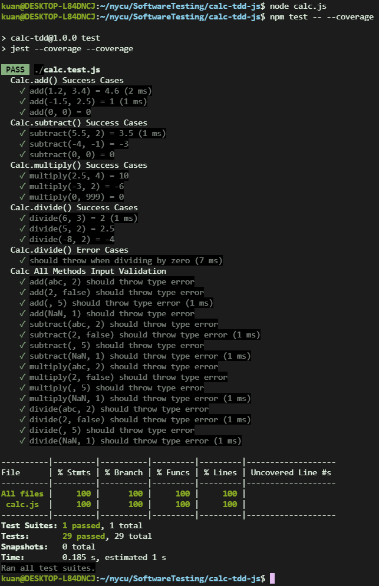

# Calc TDD 開發專案
- Software Testing Homework 2
- 學號: 313552009
- 姓名: 陳旻寬
- 本專案目標為：
    1. 使用 Test-Driven Development (TDD) 逐步開發四則運算計算機功能
    2. 每個新功能皆由測試驅動設計，包含支援浮點數運算、錯誤處理與輸入驗證
    3. 建立自動化測試與覆蓋率報告（coverage）
    4. 整合 GitHub Actions 與 GitLab CI 進行驗證與版本控管

---

## 功能規格與限制

| 功能        | 說明 |
|-------------|------|
| `add(a, b)`      | 回傳 a + b（使用浮點數） |
| `subtract(a, b)` | 回傳 a - b |
| `multiply(a, b)` | 回傳 a × b |
| `divide(a, b)`   | 回傳 a ÷ b，若 b = 0 則拋出錯誤 |
| 錯誤處理         | 若 a 或 b 非數字（number），或為 NaN，則拋出錯誤 |
| 覆蓋率報告       | 使用 Jest coverage，預期達到 100% |

---

## 開發流程（TDD 記錄）

### 1️⃣ add(a, b)
- 撰寫測試：期望 1.2 + 3.4 = 4.6
- 初始失敗（紅燈）
- 新增 `add()` 函式 → 測試通過（綠燈）

### 2️⃣ subtract(a, b)
- 撰寫測試，包含負數與 0 減法
- 新增函式後通過所有測試

### 3️⃣ multiply(a, b)
- 測試乘法包含正負數、乘 0 等情境
- 所有 case 綠燈通過

### 4️⃣ divide(a, b)
- 撰寫除法與除以 0 的錯誤處理測試
- 新增 `divide()` 並檢查除以 0 拋出錯誤

### 5️⃣ 輸入驗證（全函式共通）
- 測試 `add('abc', 2)`、`multiply(NaN, 5)` 等不合法輸入
- 封裝 `validateInput()` 檢查非 number 或 NaN
- 所有測試通過

---

## 自動化測試與 Coverage

### GitHub Actions（CI）

- 每次 `push` 或 PR，會執行 `npm test -- --coverage`
- 所有測試自動執行，CI 顯示綠燈
- 可手動檢查 coverage HTML 報告

---

## 專案結構說明

```
calc-tdd-js/
├── calc.js                # 主程式 - Calc 類別
├── calc.test.js           # 測試檔 - 使用 Jest
├── coverage/              # coverage 報告自動產生
├── .github/workflows/     # GitHub Actions CI 設定
│   └── test.yml
├── .gitlab-ci.yml         # GitLab CI 設定檔
├── README.md              # 專案說明（本檔案）
├── calculator_spec.md     # 規格書（可選）
└── narrative.md           # TDD 過程紀錄（可合併進 README）
```

---

## 成果展示

- ✅ 所有測試通過（Jest）
- ✅ 覆蓋率 Coverage 達 100%
- ✅ 支援 GitHub Actions CI 測試通過
- ✅ 支援 GitLab CI 自動報告（可選）
- 📷 測試與報告畫面請見附件截圖


---

## 執行與測試方式

```bash
# 安裝
npm install

# 執行測試
npm test

# 執行測試 + coverage
npm test -- --coverage

# 開啟 coverage 報告（local）
open coverage/lcov-report/index.html
```